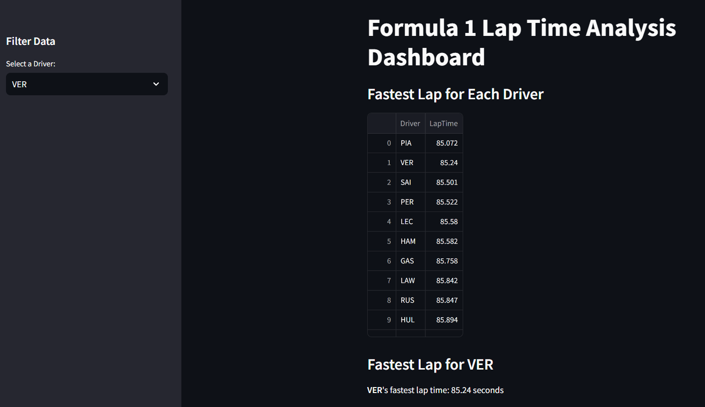
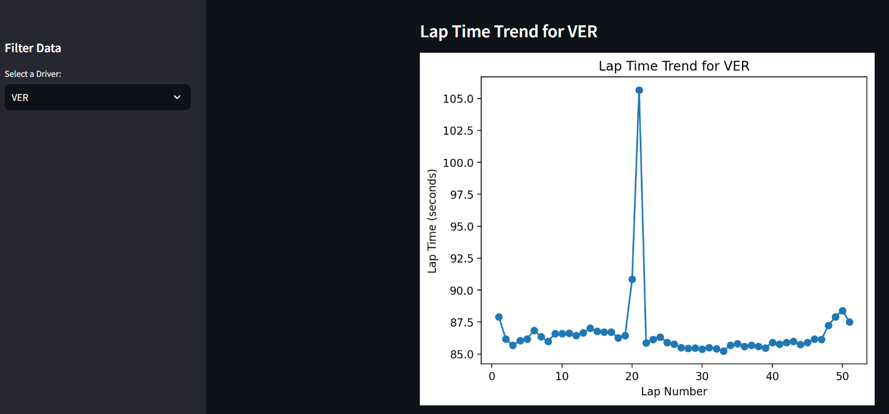
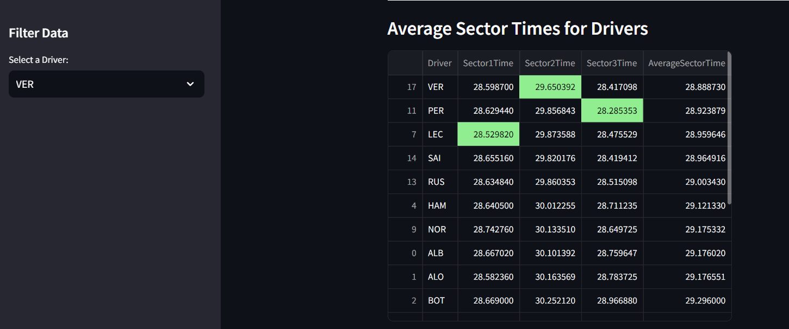
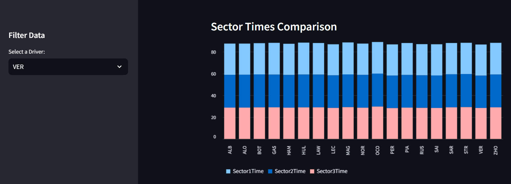

# 🏎️ Formula 1 Lap Time Analysis Dashboard by Sebastian Belalcazar Mosquera

## **Project Overview**  
This project analyses Formula 1 lap data from the Monza 2023 Grand Prix. The primary goal was to showcase my data cleaning, analysis, and visualisation skills using Python. The project features an interactive dashboard built with **Streamlit** to display insights into driver performance, lap times, and sector times.

---

## **Key Features**  
- **Fastest Lap Analysis**: Identifies the fastest lap time for each driver.  
- **Lap Time Trends**: Visualises lap time progression for individual drivers.  
- **Sector Time Comparison**: Compares average sector times for all drivers.  

---

## **Tools and Libraries**  
- **Python**: Core language for data manipulation and analysis.  
- **Pandas**: Data cleaning and processing.  
- **Matplotlib & Plotly**: Static and interactive visualisations.  
- **Streamlit**: Interactive dashboard development.  

---

## **Data Source**  
The data was extracted using the [FastF1 API](https://theoehrly.github.io/Fast-F1/) and includes:  
- **LapTime**: Total time taken to complete a lap.  
- **Sector Times**: Time taken for each of the three sectors of a lap.  
- **Driver**: Driver code (e.g., VER for Verstappen, GAS for Gasly).  
- **Lap Number**: Sequential lap numbers throughout the race.  

---

## **How It Works**  
1. **Data Cleaning**:  
   - Converted lap times and sector times into seconds for easy analysis.  
   - Removed rows with missing or invalid values.  

2. **Dashboard Insights**:  
   - **Fastest Lap**: Displays the fastest lap for each driver.  
   - **Lap Time Trends**: A line chart showing how a driver’s performance changes throughout the race.  
   - **Sector Times**: Bar charts comparing average sector times for all drivers.  

3. **Visualisation**:  
   The dashboard provides clear and interactive charts to understand driver performance.

---

## **Insights**  
1. **Fastest Lap Overall**:  
   - **Driver PIA** recorded the fastest lap with a time of **85.072 seconds**.

2. **Fastest Lap Times Per Driver**:  
   Top drivers by lap time:  
   - `PIA`: **85.072 seconds**  
   - `VER`: **85.240 seconds**  
   - `SAI`: **85.501 seconds**  
   - `PER`: **85.522 seconds**  

3. **Average Sector Times**:  
   - **Driver VER** was the fastest in Sector 1 and Sector 3:  
     - Sector 1: **28.5987 seconds**  
     - Sector 3: **28.4171 seconds**  
   - **Driver SAI** had the fastest average Sector 2 time: **29.8202 seconds**.

4. **Lap Completion**:  
   - Most drivers completed **50-51 laps**, except for **OCO** (39 laps).

---

## **Screenshots**  
Here are some visuals from the dashboard:

  
  
  
  

---

## **How to Run**  
1. Clone the repository:
   ```bash
   git clone <repository-link>
   ```
2. Install dependencies:
   ```bash
   pip install -r requirements.txt
   ```
3. Run the Streamlit app:
   ```bash
   streamlit run dashboards.py
   ```

---

## **How to Interpret the Data**  
- **LapTime**: A lower lap time indicates better performance.  
- **Sector Times**: Tracks are split into three sectors. Faster sector times indicate efficiency in specific track sections.  
- **Driver Codes**: Represent the drivers (e.g., `VER` = Verstappen, `PIA` = Piastri).  

By comparing lap times and sector times, we gain insights into individual driver performance and consistency.

---

## **Future Improvements**  
- Add more interactivity to filter by race or team.  
- Include tyre and pit stop analysis for deeper insights.  

---

## **Work in Progress**  
This project is not yet finished. I am currently learning more about the technical aspects of Formula 1 and plan to complement this dashboard with deeper analyses, such as telemetry data, tyre strategy, and pit stop performance. Stay tuned for updates!

---

## **Author**  
Created by **Sebastian Belalcazar Mosquera**. Connect with me on [LinkedIn](https://www.linkedin.com/in/sebasbelmos/) for feedback, suggestions, or collaboration opportunities!

---
